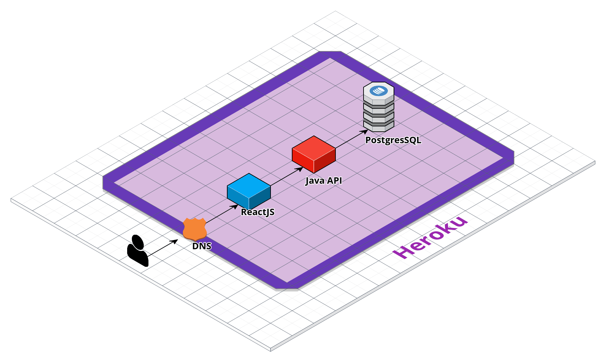

# Fortunator

Fortunator é uma aplicação web de controle financeiro que permite o usuário ter uma maior visualização de seus gastos e movimentações financeiras do dia-a-dia.

## Features

- Cadastro de usuários :heavy_check_mark:
- Sistema de login :heavy_check_mark:
- Criação de transações (Entrada e saída de dinheiro)] :heavy_check_mark:
- Extrato de transações :heavy_check_mark:
- Criação de lembretes de contas na agenda pessoal
- Distribuição de gastos por categoria
- Criação de metas financeiras e gameficação de níveis

## Tech Stack

Tecnologias usadas na construção da aplicação

- React
- Java
- Postgres
- Docker
- Docker Compose
- Heroku
- Github actions

## Local Setup

### Sonar

Para aplicar as análises do sonar, é preciso primeiramente iniciar o **server** do **sonarqube**. 

Baixe a imagem docker do sonarqube
```
docker pull sonarqube
```

Inicie o servidor
```
docker run -d -p 9000:9000 sonarqube
```

Após o server ter sido inicializado, é possível acessá-lo em `http://localhost:9000`. Nele, será necessário adicionar os projetos `fortunator-backend` e `fortunator-frontend`. 

Como o backend e o frontend do fortunator são aplicações distintas, é necessário rodar o sonar separadamente em cada pasta.

#### Backend

Nesse ponto, é necessário apenas substituir o token pelo token disponibilizado na criação do projeto no sonarqube. Como o backend é feito com o maven, a própria ferramenta já disponibiliza um comando para rodar o sonar scanner.
```
cd backend && mvn sonar:sonar \
  -Dsonar.projectKey=fortunator-backend \
  -Dsonar.host.url=http://localhost:9000 \
  -Dsonar.login=inserir_token_do_backend_aqui
```

#### Frontend

Nesse ponto, também é necessário substituir o token pelo token disponibilizado na criação do projeto no sonarqube. Além disso, para realizar a análise do projeto em react, é preciso usar a imagem do `sonar-scanner-cli`.

```
docker run \ 
    --rm \
    --net=host \
    -e SONAR_HOST_URL="http://localhost:9000" \
    -v "frontend:/usr/src" \
    sonarsource/sonar-scanner-cli \
    -Dsonar.login=inserir_token_do_frontend_aqui

```


## Tabelas do banco de dados

### Users

| Campos   |  Tipo  | Obrigatório |
| -------- | :----: | ----------: |
| name     | String |        True |
| email    | String |        True |
| password | String |        True |


### Transactions

| Campos | Tipo | Obrigatório | Descrição |
| ------------- |:-------------:| -----:|-------:|
| id | Int | True | |
| user_id | Int |  True | FK |
| transaction_category_id | Int |   False| FK |
| type | String | True |  |
| description | String | False |  |
| amount | Float | True | |
| date | Date | False | | 

### Transaction Categories

| Campos | Tipo | Obrigatório | Descrição |
| ------------- |:-------------:| -----:|-------:|
| id   | Int   | True  | |
| user_id  | Int  | True | FK |
|  name | String | True | |
| description | String | True | |


## Diagrama de infraestrutura

<p align="center">

</p>

## Autores

| [ <br /><sub>**João Zerwes**</sub>](https://github.com/joaozerwes)<br /> | [<br /><sub>**Kaique Juvencio**</sub>](https://github.com/KaiqueJuvencio)<br /> | [ <br/><sub>**Kalvin Vasconcellos**</sub>](https://github.com/0xkalvin)<br /> |
| :-----------------------------------------------------------------------------------------------------------------------------------: | :----------------------------------------------------------------------------------------------------------------------------------------------: | :--------------------------------------------------------------------------------------------------------------------------------------: |
|    [<br /><sub>**Roger Rojas**</sub>](https://github.com/Rothero)<br />     |         [ <br /><sub>**Wendel Sergio**</sub>](https://github.com/wkinho)<br />          |
